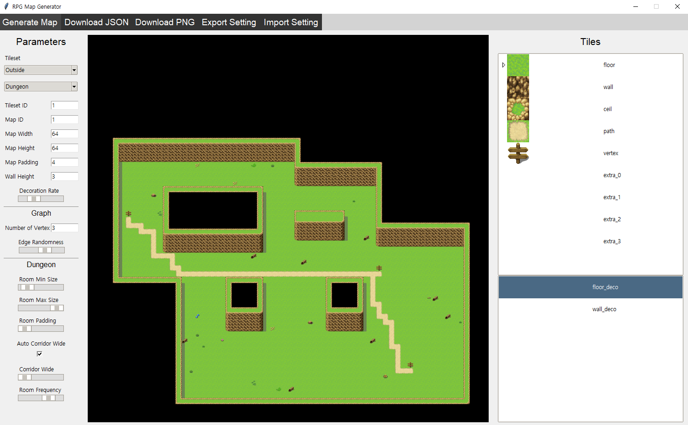

# RPG Map Generator

> RPG 맵을 생성하는 애플리케이션입니다.

- 4가지 맵 생성
	- 던전: BSP 사용
	- 동굴: 셀룰러 오토마타 사용
	- 평지
	- 자연: 심플렉스 노이즈 사용
- 그래프 경로 생성: A* 알고리즘 사용
- 타일 테마 선택
- 무작위 영역 타일 배치 (예: 물, 카펫)
- 무작위 장식 타일 배치 (바닥, 벽)
- json, png 파일 다운로드
	- RPG Maker MV와 호환됩니다.
- 파라미터 세팅 세이브 & 로드

## Stack
- Python
